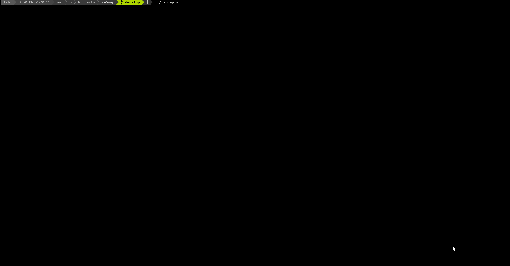

# reSnap 

reMarkable screenshots over ssh.

[](https://remarkable.com/store/remarkable)
[](https://remarkable.com/store/remarkable-2)
[](https://remarkable.com/store/remarkable-3)



## Prequisites

- SSH-access to your reMarkable tablet.
  [Tutorial](https://remarkablewiki.com/tech/ssh) <br>
  (recommended: SSH-key so you don't have to type in your root password every time)

- The following programs are required on your computer:
  - `ffmpeg`
  - `feh`


## Usage

1. Connect your reMarkable via USB
1. Run
```
./reSnap.sh
```

### Options

- `-s --source` You can specify a custom IP. If you want to use reSnap over the Wifi, specify the IP of your reMarkable here.
- `-o --output` You can specify a custom output file for reSnap. If the argument is a directory, the file name is automatically generated from the notebook name.
- `-o` The current directory is used as the implicit argument of the option above.
- `-l --landscape` Snapshot has now the landscape orientation.
- `-d --display` Force program to display the snapshot. (overwrites environment variable)
- `-n --no-display` Force program to not display the snapshot.
- `-c --og-color` Turn off color correction (color correction is only active for the reMarkable2)
- `-p --og-pixel-format` Turns off the byte correction (use this if your reMarkable is on version < 3.6)
- `-x --clipboard` Copies the result into the clipboard.
- `-f --sketch` Removes the white background from the result.
- `-v --version` Displays version.
- `-h --help` Displays help information.

### Environment Variables

- `REMARKABLE_IP` Default IP of your reMarkable.
- `RESNAP_DISPLAY` Default behavior of displaying the snapshot. See options `-d` and `-n`.
- `REMARKABLE_INVERT_COLORS` Default behavior of color inversion. See option `-i`.
- `RESNAP_COLOR_CORRECTION` Default behavior of color correction on the reMarkable2. See option `-c`.
- `RESNAP_BYTE_CORRECTION` Default behavior of color correction on the reMarkable2 version >= 3.6. See option `-b`.

`RESNAP_DISPLAY`, `RESNAP_COLOR_CORRECTION` and `RESNAP_BYTE_CORRECTION` are boolean parameters.
Everything other than `true` is interpreted as `false`!

## Recommended for better performance

It is recommended to install `lz4` on both your computer and the reMarkable tablet.

### Installing Programs on your reMarkable

#### Manually

Copy the provided binary `lz4.arm.static` to your reMarkable and make it executable.
The binary is version `1.9.2`.

```bash
scp lz4.arm.static root@$REMARKABLE_IP:/home/root/lz4
ssh root@$REMARKABLE_IP 'chmod +x /home/root/lz4'
```

#### Using Toltec

This is only recommended for versions up to `2.15.1.1189` at the time of writing.
You might brick your reMarkable otherwise!
Check for [the warning here](https://toltec-dev.org/#install-toltec).

Please use [Toltec](https://github.com/toltec-dev/toltec) to install `lz4` on your reMarkable.

Packages:
- `lz4`

Note: before installing the packages, run
```
opkg update
opkg upgrade
```
once and then install the packages via
```
opkg install <pkg>
```

Remember to run `toltecctl reenable` on your reMarkable tablet after each software update.

### Disclaimer

The majority of the code is copied from [reStream](https://github.com/rien/reStream). Be sure to check them out!
